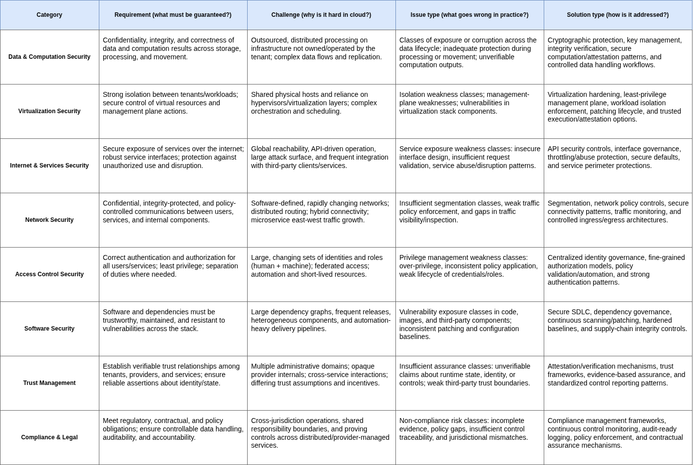

### Extracting effective categorization of cloud security for better understanding of the literature: 

From surveys [Survey 2015](https://dl.acm.org/doi/10.1145/2767005) and [Survey 2017](https://www.sciencedirect.com/science/article/pii/S1084804516302983) multiple taxonomies and categorization were proposed + different selection criteria. (Detailed notes of the papers here "../papers/ 2015 survey..." and ../papers/2017 survey...)  

After deeper understanding i extracted the 8 categories below : 
***Data & Computation Security, Virtualization Security, Internet & Services Security, Network Security, Access Control Security, Software Security, Trust Management and Compliance & Legal***  

Every survey aimed requirement, issues, challenges and solution separately. Then they will be added as new dimension to our categorization and then linked with the defined model of the PhD
***("8 categories above"; "4 dimensions of cloud sec"; "5 thesis models" )***  

**Table 1 : Categories x dimensions** (Deeper categories understanding from different dimensions)

