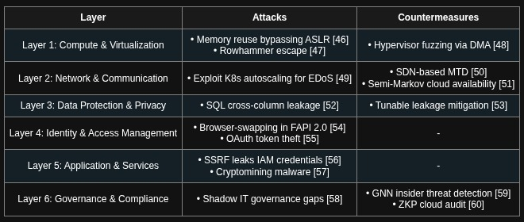

---
***This doc summarize foundational threats/attacks and countermeasures landscape widely surveys + Some state of the art novel attacks and countermeasures 2019-Present***
___
# Layer 1  Compute & Virtualization Security
**Concerns hardware, data centers, hypervisors, and virtual machines.**

## Attacks

- **VM Escape Attacks**  
  Exploiting hypervisor vulnerabilities to escape guest VM and access host system. [1][2]
- **Cross-VM Side-Channel Attacks (Prime+Probe, Flush+Reload)**  
  Extracting cryptographic keys via shared cache timing analysis. [3][4]
- **VM Rollback Attack**  
  Reverting VM to previous state to replay credentials or bypass patches. [5]
- **Malicious VM Image Injection**  
  Publishing infected VM images in public repositories. [6]
- **Blue Pill Hypervisor Rootkits**  
  Installing stealth hypervisors below the OS layer. [7]

Novel Attacks

## Countermeasures

- Hypervisor hardening and microkernel-based VMMs [2]  
- Cache partitioning and noise injection [4]  
- VM image integrity verification (hash-based attestation) [6]  
- TPM-based remote attestation [8]  
- Virtual Machine Introspection (VMI) [1]

---

# Layer 2  Network & Communication Security
**Concerns data in transit and cloud networking infrastructure.**

## Attacks / Threats

- **EDoS (Economic Denial of Sustainability)**  
  Triggering auto-scaling to financially exhaust cloud consumers. [9]
- **Cross-VM Packet Sniffing**  
  Exploiting virtual switch misconfigurations. [10]
- **ARP Spoofing in Virtual Networks**  
  Man-in-the-cloud attack via network poisoning. [11]
- **Wormhole Attacks (Cloud-Connected IoT)**  
  Tunneling traffic to manipulate routing. 
- **SDN Controller Hijacking**  
  Compromising centralized SDN control planes. [13]

## Countermeasures

- EDoS Shield frameworks [9]  
- Secure virtual switch configuration (Open vSwitch hardening) [10]  
- TLS-secured SDN southbound interfaces [13]  
- Network anomaly detection using ML [14]  
- Microsegmentation and zero-trust networking [13]

---

# Layer 3  Data Protection & Privacy
**Concerns confidentiality, integrity, and privacy of stored and processed data.**

## Attacks/ Threats

- **Cross-Tenant Data Leakage**  
  Memory-based inference attacks between co-resident VMs. [3]
- **Encryption Key Extraction from VM Memory**  
  Memory snapshot analysis attacks.
- **Data Remanence Attacks**  
  Recovering deleted data from shared storage blocks. [16]
- **Searchable Encryption Leakage Attacks**  
  Access pattern inference in encrypted databases. [17]
- **Graph De-Anonymization Attacks**  
  Re-identifying anonymized users in cloud-hosted datasets. [18]

## Countermeasures

- Homomorphic Encryption [19]  
- Attribute-Based Encryption (ABE) [20]  
- Secure key lifecycle management [21]  
- Oblivious RAM (ORAM) [17]  
- Data fragmentation and dispersal techniques [22]

---

# Layer 4  Identity & Access Management (IAM)
**Concerns authentication, authorization, and identity systems.**

## Attacks/ Threats

- **OAuth Token Replay Attack**  
  Exploiting redirect URI vulnerabilities. [23]
- **OpenID Connect Mix-Up Attack**  
  Identity provider confusion attack. [24]
- **Sybil Attacks in Cloud Trust Systems**  
  Creating fake identities to manipulate reputation. [25]
- **Session Riding (CSRF) in Cloud APIs** [26]
- **Man-in-the-Browser Credential Injection** [27]

## Countermeasures

- Formal verification of OAuth flows [24]  
- Multi-factor authentication with hardware tokens [28]  
- Zero-trust access architecture [29]  
- Risk-adaptive authentication systems [30]  
- PKCE and token binding extensions [23]

---

# Layer 5  Application & Services Security
**Concerns SaaS, APIs, containers, and cloud applications.**

## Attacks/ Threats

- **XML Signature Wrapping (SOAP Wrapping Attack)** [31]
- **Server-Side Request Forgery (SSRF) in Cloud Metadata Services** [32]
- **Insecure Deserialization Attacks** [33]
- **Cloud Resource Abuse (Cryptomining Exploits)** [34]
- **Container Escape (runC CVE-2019-5736)** [35]

## Countermeasures

- Secure SDLC practices and static analysis [36]  
- XML signature validation hardening [31]  
- Container isolation (gVisor, Kata Containers) [35]  
- API gateway security enforcement [37]  
- Runtime Application Self-Protection (RASP) [38]

---

# Layer 6  Governance & Compliance
**Concerns human factors, policies, legal and regulatory compliance.**

## Attacks/ Threats

- **Malicious Insider Data Exfiltration** [39]
- **SLA Manipulation & Audit Weakness Exploitation**
- **Shadow IT Risk Amplification** [41]
- **Cross-Border Data Compliance Violations (GDPR Risks)** [42]
- **Reputation Manipulation in Trust Systems** [25]

## Countermeasures

- Blockchain-based tamper-proof audit logs [43]  
- Continuous compliance monitoring systems [44]  
- Zero-knowledge proof audit mechanisms [45]  
- Behavioral insider threat detection [39]  
- Cloud trust and reputation management models [25]

___
# SoTA novel Attacks and countermeasures (2019–Present)

## Layer 1 : Compute & Virtualization Security

| #    | Authors & Year       | Title                                                                | Type           | Contribution                                                              |
| ---- | -------------------- | -------------------------------------------------------------------- | -------------- | ------------------------------------------------------------------------- |
| [46] | Ren et al., 2025     | Breaking Isolation: Cross-Domain Attacks on Hypervisors              | Attack         | Guest memory reuse as exploitation primitive to bypass ASLR.              |
| [47] | Chen et al., 2025    | HyperHammer: Breaking Free from KVM-Enforced Isolation               | Attack         | Rowhammer bit-flip escapes KVM isolation from inside guest VM.            |
| [48] | Bulekov et al., 2024 | HyperPill: Fuzzing Hypervisors via Hardware Virtualization Interface | Countermeasure | DMA-aware fuzzer proactively discovers hypervisor device vulnerabilities. |

---

## Layer 2 : Network & Communication Security

| #    | Authors & Year            | Title                                                             | Type           | Contribution                                                         |
| ---- | ------------------------- | ----------------------------------------------------------------- | -------------- | -------------------------------------------------------------------- |
| [49] | ACM SIGMETRICS, 2025      | Exploiting Kubernetes Autoscaling for EDoS                        |  Attack        | MDP model optimizes financial exhaustion of K8s autoscaling targets. |
| [50] | Sengupta et al., 2020     | A Survey of Moving Target Defenses for Network Security           | Countermeasure | Formal notation quantifies SDN-based MTD attack surface reduction.   |
| [51] | Lalropuia & Khaitan, 2021 | Availability Analysis of Cloud under EDoS: A Semi-Markov Approach | Countermeasure | Semi-Markov model derives cloud availability thresholds under EDoS.  |

---

## Layer 3 : Data Protection & Privacy

| #    | Authors & Year         | Title                                                                  | Type           | Contribution                                                               |
| ---- | ---------------------- | ---------------------------------------------------------------------- | -------------- | -------------------------------------------------------------------------- |
| [52] | Hoover et al., 2024    | Leakage-Abuse Attacks Against Structured Encryption for SQL            |  Attack        | Cross-column frequency leakage recovers plaintexts from encrypted SQL.     |
| [53] | Demertzis et al., 2020 | SEAL: Attack Mitigation for Encrypted Databases via Adjustable Leakage | Countermeasure | Tunable leakage budget minimizes inference attack success at low overhead. |

---

## Layer 4 : Identity & Access Management (IAM)

| #    | Authors & Year       | Title                                                          | Type    | Contribution                                                       |
| ---- | -------------------- | -------------------------------------------------------------- | ------- | ------------------------------------------------------------------ |
| [54] | Fett et al., 2022    | Formal Security Analysis of the OpenID Financial-grade API 2.0 |  Attack | Formal WIM analysis uncovers browser-swapping attack in FAPI 2.0.  |
| [55] | Jannett et al., 2022 | DISTINCT: Identity Theft Using In-Browser Communications       | Attack  | postMessage API exploited as covert channel for OAuth token theft. |

---

## Layer 5 : Application & Services Security

| #    | Authors & Year                 | Title                                               | Type    | Contribution                                                                    |
| ---- | ------------------------------ | --------------------------------------------------- | ------- | ------------------------------------------------------------------------------- |
| [56] | Palo Alto Unit 42, 2021        | SSRF Exposes Data Across Major Cloud Providers      |  Attack | 56% of vulnerable cloud instances leak IAM credentials via SSRF.                |
| [57] | Pastrana & Suarez-Tangil, 2019 | A First Look at the Crypto-Mining Malware Ecosystem | Attack  | Empirical mapping of cryptomining infection vectors and cloud credential abuse. |

---

## Layer 6 : Governance & Compliance

| #    | Authors & Year          | Title                                                      | Type           | Contribution                                                                    |
| ---- | ----------------------- | ---------------------------------------------------------- | -------------- | ------------------------------------------------------------------------------- |
| [58] | Silic & Back, 2019      | Shadow IT : A View from Behind the Curtain                 | Attack         | Formal model quantifies governance gaps driving unsanctioned cloud adoption.    |
| [59] | Xiao et al., 2023       | Robust Insider Threat Detection Using Graph Neural Network | Countermeasure | GNN captures multi-hop access dependencies undetectable by flat ML models.      |
| [60] | Campanelli et al., 2018 | ZKP-Based Verifiable Audit for Outsourced Cloud Data       | Countermeasure | Composable ZKP proofs verify cloud compliance without exposing underlying data. |

___

***Summary of Novel Papers From 2019-peresent*** : 

| Layer     | Attacks  | Countermeasures | Total  |
| --------- | -------- | --------------- | ------ |
| L1        | [46][47] | [48]            | 3      |
| L2        | [49]     | [50][51]        | 3      |
| L3        | [52]     | [53]            | 2      |
| L4        | [54][55] |                 | 2      |
| L5        | [56][57] |                 | 2      |
| L6        | [58]     | [59][60]        | 3      |
| **Total** | **9**    | **6**           | **15** |

---

# Summarizing : 

***Table Foundational Attacks and Countermeasures Summary Table : 

***Novel Attacks and Countermeasures 2019-Present, Summary Table***

___
# References

**[1]** [Abdul Azim Ahmed Ali, _“Virtual Machine Escapes”_, Technical Article, 2013.](https://www.researchgate.net/publication/255791810_Virtual_Machine_Escapes)  
**[2]** [Daniel Perez-Botero, Jakub Szefer, Ruby B. Lee, _“Characterizing Hypervisor Vulnerabilities in Cloud Computing Servers”_, ACM Computing Surveys, 2013.  ](https://dl.acm.org/doi/abs/10.1145/2484402.2484406)  
**[3]** [Thomas Ristenpart, Eran Tromer, Hovav Shacham, Stefan Savage, _“Hey, You, Get Off of My Cloud: Exploring Information Leakage in Third-Party Compute Clouds”_, ACM CCS, 2009.  ](https://dl.acm.org/doi/abs/10.1145/1653662.1653687)  
**[4]** [Yinqian Zhang, Ari Juels, Michael K. Reiter, Thomas Ristenpart, _“Cross-VM Side Channels and Their Use to Extract Private Keys”_, ACM CCS, 2012.  ](https://dl.acm.org/doi/abs/10.1145/2382196.2382230)  
**[5]** [Sven Bugiel, Stefan Nürnberger, Thomas Pöppelmann, Ahmad-Reza Sadeghi, _“Twin Clouds: An Architecture for Secure Cloud Computing”_, EuroSys Workshop, 2011. ](https://cachin.com/cc/csc2011/submissions/bugiel.pdf)   
**[6]** [Jinpeng Wei, Xiaolan Zhang, Glenn Ammons, Vasanth Bala, Peng Ning, _“Managing Security of Virtual Machine Images in a Cloud Environment”_, ACM CCS, 2009.  ](https://dl.acm.org/doi/abs/10.1145/1655008.1655021)  
**[7]** [Joanna Rutkowska, _“Subverting Vista Kernel for Fun and Profit”_, Black Hat USA, 2006. (Blue Pill rootkit introduction)  ](http://www.orkspace.net/secdocs/Conferences/BlackHat/Asia/2006/Subverting%20Vista%20Kernel%20For%20Fun%20And%20Profit.pdf)  
**[8]** [Nuno Santos, Krishna P. Gummadi, Rodrigo Rodrigues, _“Towards Trusted Cloud Computing”_, HotCloud, 2009. ](https://www.usenix.org/legacy/event/hotcloud09/tech/full_papers/santos.pdf)  
**[9]** [Joseph Idziorek, Mark Tannian, _“Exploiting Cloud Utility Models for Profit and Ruin”_, IEEE CloudCom, 2011. (EDoS discussion)  ](https://ieeexplore.ieee.org/abstract/document/6008690)  
**[10]** [Garfinkel, T., Rosenblum, M.  _When Virtual is Harder than Real: Security Challenges in Virtual Machine Based Computing Environments._  HotOS, 2005.](https://www.usenix.org/legacy/events/hotos05/prelim_papers/garfinkel/garfinkel_html/)  
**[11]**  TBF  
**[13]** [Diego Kreutz et al., _“Software-Defined Networking: A Comprehensive Survey”_, ACM SIGCOMM Computer Communication Review, 2015.](https://ieeexplore.ieee.org/abstract/document/6994333)  
**[14]** TBF  
**[16]** [Joel Reardon et al "SoK: Secure Data Deletion", 2013 IEEE Symposium on Security and Privacy (SP '13).](https://dl.acm.org/doi/10.1109/SP.2013.28)  
**[17]** [Stefanov, _“Path ORAM: An Extremely Simple Oblivious RAM Protocol”_, ACM CCS, 2013. ](https://dl.acm.org/doi/abs/10.1145/3177872)  
**[18]** [Arvind Narayanan, Vitaly Shmatikov, _“De-anonymizing Social Networks”_, IEEE Symposium on Security and Privacy, 2009.  ](https://ieeexplore.ieee.org/abstract/document/5207644)  
**[19]** [Craig Gentry, _“Fully Homomorphic Encryption Using Ideal Lattices”_, STOC, 2009.  ](https://dl.acm.org/doi/abs/10.1145/1536414.1536440)  
**[20]** [Amit Sahai, Brent Waters, _“Fuzzy Identity-Based Encryption”_, EUROCRYPT, 2005. (Foundation of ABE)  ](https://link.springer.com/chapter/10.1007/11426639_27)  
**[21]** [NIST, _“NIST Special Publication 800-57: Recommendation for Key Management”_. ](https://csrc.nist.gov/pubs/sp/800/57/pt1/r5/final)  
**[22]** [Kresimir Popovic, Zeljko Hocenski, _“Cloud Computing Security Issues and Challenges”_, MIPRO, 2010.  ](https://ieeexplore.ieee.org/abstract/document/5533317)  
**[23]** [Daniel Fett, Ralf Küsters, Guido Schmitz, _“A Comprehensive Formal Security Analysis of OAuth 2.0”_, ACM CCS, 2016.  ](https://dl.acm.org/doi/abs/10.1145/2976749.2978385)  
**[24]** [Daniel Fett, Ralf Küsters, Guido Schmitz, _“The Web SSO Standard OpenID Connect: In-depth Formal Security Analysis and Security Guidelines”_, IEEE Security & Privacy, 2017.  ](https://ieeexplore.ieee.org/abstract/document/8049720)  
**[25]** [John R. Douceur, _“The Sybil Attack”_, IPTPS, 2002. ](http://sieci.pjwstk.edu.pl/media/bibl/[Douceur]_[Sybil%20Attack]_[IPTPS]_[2002].pdf)   
**[26]** [Adam Barth, Collin Jackson, John C. Mitchell, _“Robust Defenses for Cross-Site Request Forgery”_, IEEE Security & Privacy, 2008.  ](https://dl.acm.org/doi/abs/10.1145/1455770.1455782)  
**[27]** TBF  
**[28]** [Joseph Bonneau et al., _“The Quest to Replace Passwords: A Framework for Comparative Evaluation of Web Authentication Schemes”_, IEEE Security & Privacy, 2012. ](https://ieeexplore.ieee.org/abstract/document/6234436)   
**[29]** [Scott Rose et al., _“Zero Trust Architecture”_, NIST SP 800-207, 2020.  ](https://nvlpubs.nist.gov/nistpubs/SpecialPublications/NIST.SP.800-207.pdf)  
**[30]** F[adi Aloul et al., _“Two Factor Authentication Using Mobile Phones”_, IEEE AICCSA, 2009.](https://ieeexplore.ieee.org/abstract/document/5069395)    
**[31]** [Michael McIntosh, Paula Austel, _“XML Signature Element Wrapping Attacks and Countermeasures”_, IEEE Security & Privacy, 2005.  ](https://dl.acm.org/doi/abs/10.1145/1103022.1103026)  
**[32]** [Shweta Sharma, _“Hackers Target SSRF Flaws to Steal AWS Credentials”_, CSO Online, 2025.  ](https://www.csoonline.com/article/3959148/hackers-attempted-to-steal-aws-credentials-using-ssrf-flaws-within-hosted-sites.html)  
**[33]** [Chris Frohoff, Gabriel Lawrence, _“Marshalling Pickles: How Deserializing Objects Can Ruin Your Day”_, AppSec California, 2015.  ](https://frohoff.github.io/appseccali-marshalling-pickles/)  
**[34]** TBF  
**[35]** [RunC Container Escape Vulnerability (CVE-2019-5736)](https://www.cve.org/CVERecord?id=CVE-2019-5736)  
**[36]** [Gary McGraw, _“Software Security”_, IEEE Security & Privacy, 2006.](https://www.khoury.northeastern.edu/home/lieber/courses/csg379/f04/lectures/Software_Security.pdf)  
**[37]** [OWASP, _“OWASP API Security Top 10”_](https://owasp.org/API-Security/editions/2023/en/0x00-header/).  
**[38]** TBF  
**[39]** [Miltiadis Kandias et al., _“Proactive Insider Threat Detection Through Social Media and Behavioral Analysis”_, IEEE TIFS, 2010.  ](https://dl.acm.org/doi/abs/10.1145/2517840.2517865)  
**[41]** TBF  
**[42]** TBF  
**[43]** [Guy Zyskind, Oz Nathan, Alex Pentland, _“Decentralizing Privacy: Using Blockchain to Protect Personal Data”_, IEEE Security & Privacy Workshops, 2015.  ](http://ieeexplore.ieee.org/document/7163223)  
**[44]** [Keiko Hashizume et al., _“An Analysis of Security Issues for Cloud Computing”_, Journal of Cloud Computing, 2013.  ](https://link.springer.com/article/10.1186/1869-0238-4-5)  
**[45]** TBF  
[46] [Ren et al., *"Breaking Isolation: A New Perspective on Hypervisor Exploitation via Cross-Domain Attacks"*, arXiv, 2025](https://arxiv.org/abs/2512.04260)  
[47] [Chen et al., *"HyperHammer: Breaking Free from KVM-Enforced Isolation"*, ASPLOS, 2025](https://yuval.yarom.org/pdfs/ChenZZSYGYW25.pdf)  
[48] [Bulekov et al., *"HyperPill: Fuzzing for Hypervisor-bugs by Leveraging the Hardware Virtualization Interface"*, USENIX Security, 2024](https://www.usenix.org/system/files/usenixsecurity24-bulekov.pdf)  
[49] [Grooten et al., *"Exploiting Kubernetes Autoscaling for Economic Denial of Sustainability"*, ACM SIGMETRICS / POMACS, 2025](https://dl.acm.org/doi/10.1145/3727114)  
[50] [Sengupta et al., *"A Survey of Moving Target Defenses for Network Security"*, IEEE Communications Surveys & Tutorials, 2020](https://ieeexplore.ieee.org/document/9016033)  
[51] [Lalropuia & Khaitan, *"Availability and Reliability Analysis of Cloud Computing under EDoS Attack: A Semi-Markov Approach"*, Cluster Computing, 2021](https://link.springer.com/article/10.1007/s10586-021-03257-9)  
[52] [Hoover et al., *"Leakage-Abuse Attacks Against Structured Encryption for SQL"*, USENIX Security, 2024](https://www.usenix.org/conference/usenixsecurity24/presentation/hoover)  
[53] [Demertzis et al., *"SEAL: Attack Mitigation for Encrypted Databases via Adjustable Leakage"*, USENIX Security, 2020](https://www.usenix.org/conference/usenixsecurity20/presentation/demertzis)  
[54] [Fett et al., *"Formal Security Analysis of the OpenID Financial-grade API 2.0"*, OpenID Foundation, 2022](https://openid.net/wordpress-content/uploads/2022/12/Formal-Security-Analysis-of-FAPI-2.0_FINAL_2022-10.pdf)  
[55] [Jannett et al., *"DISTINCT: Identity Theft Using In-Browser Communications"*, ACM CCS, 2022](https://dl.acm.org/doi/10.1145/3548606.3560692)  
[56] [Palo Alto Unit 42, *"Server-Side Request Forgery Exposes Data of Technology, Industrial, and Media Organizations"*, 2021](https://unit42.paloaltonetworks.com/server-side-request-forgery-exposes-data-of-technology-industrial-and-media-organizations/)  
[57] [Pastrana & Suarez-Tangil, *"A First Look at the Crypto-Mining Malware Ecosystem: A Decade of Unrestricted Growth"*, ACM IMC, 2019](https://dl.acm.org/doi/10.1145/3355369.3355576)  
[58] [Silic & Back, *"Shadow IT — A View from Behind the Curtain"*, Computers & Security, 2019](https://www.sciencedirect.com/science/article/pii/S0167404814001540)  
[59] [Xiao et al., *"Robust Anomaly-Based Insider Threat Detection Using Graph Neural Network"*, IEEE TNSM, 2023](https://ieeexplore.ieee.org/document/9950701)  
[60] [Campanelli et al., *"LegoSNARK: Modular Design and Composition of Succinct Zero-Knowledge Proofs"*, ACM CCS, 2019](https://dl.acm.org/doi/10.1145/3319535.3339820)  
