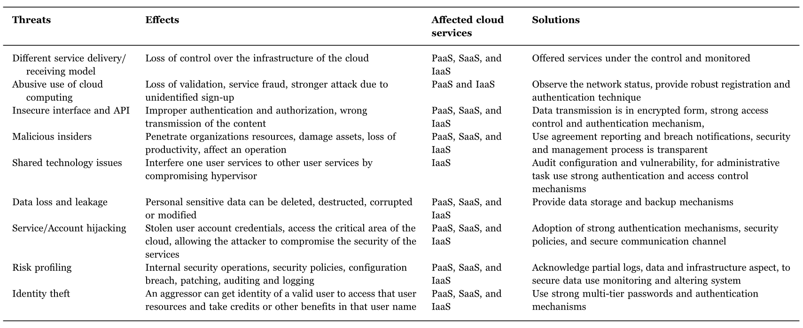
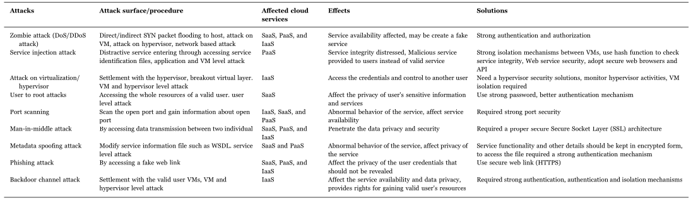
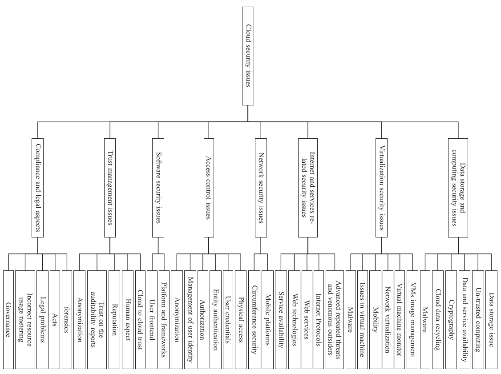

### [***Cloud Security Issues and Challenges : A Survey***](https://www.sciencedirect.com/science/article/pii/S1084804516302983)

The survey discuss briefly the key features of cloud computing, security issues and the solution of these issues, cloud architectures, services deployment, security concepts, threats and attacks.
Finally a discussion about the open research issues for cloud security. 

---
- ***Related work section*** cites 21 surveys from 2010 to 2015 talking mainly about security and privacy issues, challenges and categorization of these security issues. 

- ***Cloud Computing architectural framework***,   
	- ***NIST*** defined 3 service models, 5 characteristics and 4 deployment models in.
		- ***Characteristics***: On-demand self service, broad network access,  resource pooling, rapid elasticity, measured service  
		- ***Service Models***: SaaS, IaaS, PaaS   
		- ***Deployment models***: Private, public, communiry, hybrid cloud  
	- ***Storage Models***: how to store data in cloud, 3 models with benifits and limitations   
		***Shared File/ Block Storage System***, ***Object Storage System***, ***DB storage system***

- ***Cloud Technology***, is the set of technologies that enables key features and characteristics cited above. These techs  are defined in this section. (Internet, data-centers, virtualization, web tech, multi-tenant tech and service tech)

- ***Cloud Security*** in this paper is addressed in 5 parts : 
	- Cloud Sec Concepts : 12 concepts presented such as (threat agent, security controls,..)
	- Requirements of cloud sec : authentication/identification, authorization, confidentiality, integrity, non-repudiation and availability
	- Threats to cloud : 9 threats summarized in table below 
	
	
	
	- Attacks on cloud sec : 9 attacks summarized in table below
	
	
	
	-  Data center Security :  Physical security is fundamental (secure buildings, protected servers..), services and storage is secure by firewalls, IPSec, IDS/IPS, honeyports, SOC, CSIRT, SIEM for : traffic analysis, intrusion detection, event correlation and incident response.

- ***Cloud Sec Issues***: this section's goal is categorizing sec issues into 8 categories each category have topics. Each topic presents the related security issues and their solutions. Then for every category we have a comprehensive table presenting topics, related issues, papers addressing the topic and the security solution. 
	
	
	